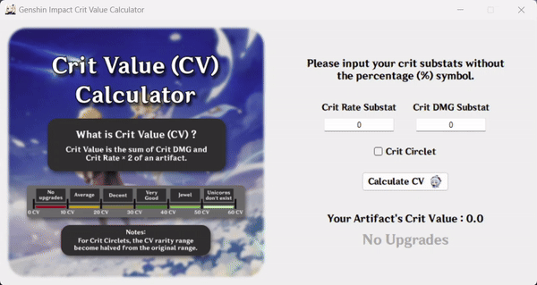

 

# Genshin Impact Crit Value Calculator

This is a project about Genshin Impact Crit Value (CV) Calculator that are made with <b>Python</b> and <b>Tkinter GUI Interface</b>.

I made this program since I don't see any popular online resource or website <i>(CMIIW)</i> that can calculate an artifact's CV. Even if it's pretty easy to calculate your own artifact's CV, I'm sure that some people (or might just me :p) that are kind of lazy to do some math just for a game.

## How to Use

    Input your Crit substats (both Crit Rate and Drit DMG) of your artifact on the entry box and hit that "Calculate CV" with a small cocogoat button.  

  
    Your Artifact's CV Tier will be displayed on the text right below the button, automatically after you hit it. Somehow, there is a chance where some of you might put the impossible Crit substats <i>(and yes, I know some of you will try to do that)</i> so I added a little prevention for that :&#41;

<h3 align="center">
     
     
    [ WIP - Website Version Coming Soon ]
</h3>
